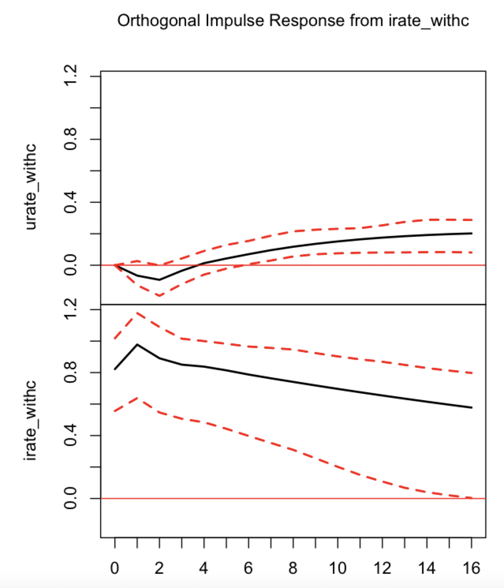
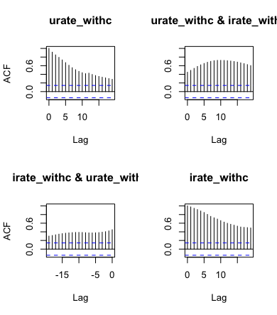

# Analyzing the Impact of Monetary Policy on Montana's Economy: A VAR Approach

📈 *An empirical investigation of how federal interest rates influence Montana's real GDP growth and unemployment rate using Vector Autoregression (VAR) models.*

---

## 📌 Project Overview

This project explores the dynamic relationship between monetary policy and economic activity in the state of **Montana**. Using **Vector Autoregression (VAR)** models and impulse response functions, we evaluate the **causal impact** of the **Federal Funds Rate** on:

- Real GDP Growth
- Unemployment Rate

The analysis is part of a macroeconomics data project (ECON 112 @ UCSD), with a focus on both **pre-COVID and post-COVID robustness**.

---

## 🧠 Motivation

> How does interest rate policy affect the local economy at a state level?

While macroeconomic models often operate at the national level, this study zooms in on **state-specific effects**, using Montana as a case study to examine how monetary policy might ripple through regional labor markets and output growth.

---

## 📁 Project Structure

. ├── code/ # R scripts for full analysis ├── plots/ # Key visualizations (IRF, ACF, trend) ├── raw_data/ # Input datasets (FRED) ├── report/ # Final PDF report └── README.md # You're here!


---

## 🔍 Methodology

- **Data Source**: [FRED](https://fred.stlouisfed.org/)
- **Models Used**: 
  - Vector Autoregression (VAR)
  - Structural IRF (Sims, 1980; Cholesky decomposition)
- **Software**: R (`vars`, `tseries`)

---

## 📊 Key Visualizations

### Output Growth Response to Interest Rate Shock (Pre-COVID)


### Unemployment Rate Response to Interest Rate Shock (Including COVID)



### Autocorrelation of Unemployment & Interest Rate



---

## 📌 Summary of Findings

| Variable        | Impact of Interest Rate Shock     | Statistical Significance | Comment                         |
|----------------|-----------------------------------|---------------------------|----------------------------------|
| **Real GDP**   | Short-lived, near-zero response   | ❌ Not significant        | Aligns with ACF and VAR results |
| **Unemployment** | Delayed positive response (peak ~Q6) | ⚠️ Marginal significance | Effect diminishes after Q12     |

---

## 📂 Raw Data Files

All data sourced from [FRED](https://fred.stlouisfed.org/):

| File | Description |
|------|-------------|
| `Montana_RealGDP.csv` | Real GDP, quarterly (1997–2022) |
| `FEDFUNDS.csv`        | Federal Funds Rate, monthly (1954–2023) |
| `MTUR.csv`            | Unemployment Rate, monthly (1976–2023) |

See `raw_data/README.md` for more info.

---

## 🧪 How to Reproduce

> Clone the repository and run the R scripts inside `code/`

1. Install dependencies:
   ```r
   install.packages("tseries")
   install.packages("vars")
Run the main script:
