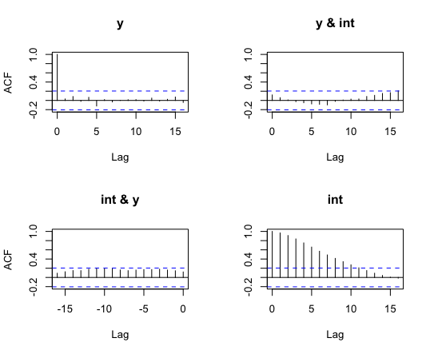

# Monetary Policy and Economic Activity in Montana: A VAR-Based Project


---

## 🖼️ Project Banner



---

## 📌 Overview
> 📚  Macroeconomic Data Analysis  
> ✍️ Author: Mingtian Chen

---

## 📦 Project Structure

```
monetary-policy-analysis/
├── code/           # R scripts and dependencies
├── raw_data/       # Cleaned FRED data (CSV)
├── plots/          # Key visualizations (IRF, ACF, trend)
├── report/         # Final written report (PDF)
└── README.md       # Project overview
```


---

## 🧪 Methodology

- **Model**: Vector Autoregression (Sims 1980)
- **Tools**: R, packages `vars`, `tseries`
- **Data Source**: FRED (Federal Reserve Economic Data)
- **Period**: 1997–2023, with and without COVID-era data
- **Focus**: Montana state-level economic indicators

---

## 📌 Main Findings

- **Real GDP Growth** shows no statistically significant response to interest rate shocks.
- **Unemployment Rate** shows a delayed positive response (peak around 5–6 quarters), then fades.
- COVID-period inclusion does not change the general trend, but increases variance.

---

## 📂 Data Overview

All data is publicly available from FRED:

| File                | Description                             |
|---------------------|-----------------------------------------|
| Montana_RealGDP.csv | Montana Real GDP, quarterly             |
| FEDFUNDS.csv        | Federal Funds Rate, monthly             |
| MTUR.csv            | Montana Unemployment Rate, monthly      |

See `raw_data/README.md` for detailed notes.

---

## 🧰 How to Run

1. Clone the repository
2. Install dependencies in R:
   install.packages("vars")
   install.packages("tseries")

3. Run the main script:
   source("code/var_analysis.R")

---

## 📝 Full Report

Read the full PDF report with theory, modeling, results, and discussion:  
[📄 montana_VAR_report.pdf](report/montana_VAR_report.pdf)


---

## 🙌 Acknowledgments

- Instructor: Giacomo Rondina
- Data Source: Federal Reserve Economic Data (FRED)


---

## 📄 License

This project is licensed under the MIT License. See the [LICENSE](LICENSE) file for details.


